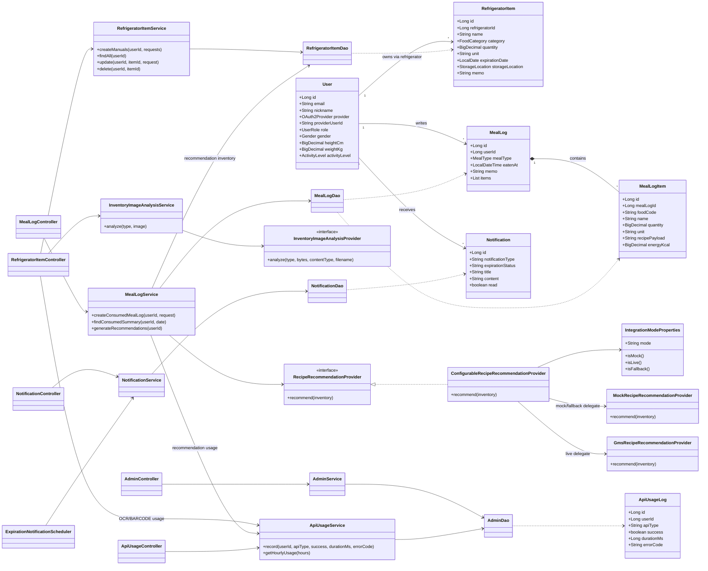
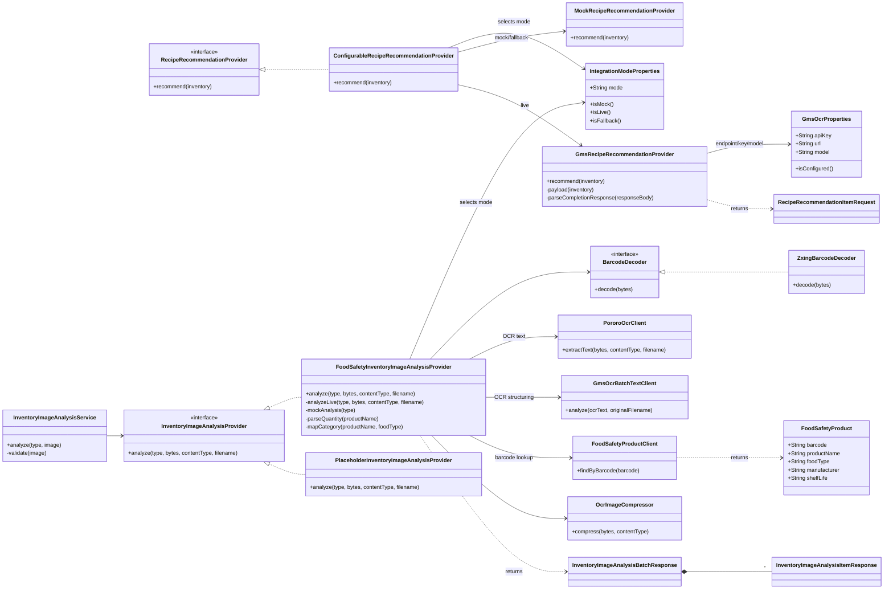

# 클래스 다이어그램

## 설계 관점

YumYum 백엔드는 도메인별 `controller -> service -> dao/entity` 구조를 따른다. 외부 연동은 provider/client 계층으로 분리해 `mock`, `live`, `fallback` 모드를 선택할 수 있게 했다.

이 문서는 전체 클래스의 기계적 나열이 아니라, 시연 MVP의 핵심 사용자 흐름을 설명하는 제출용 클래스 다이어그램이다. DTO/Enum, Lombok getter/setter, MyBatis XML mapper, 단순 request/response record는 가독성을 위해 일부 생략했다.

## 다이어그램 구성

| 파일 | 용도 |
| --- | --- |
| `docs/final-report/04-assets/diagrams/class-diagram.mmd` | 제출 문서 본문에 넣을 핵심 클래스 다이어그램 |
| `docs/final-report/04-assets/diagrams/class-diagram-integration-detail.mmd` | 발표에서 mock/live/fallback과 OCR/바코드 연동을 설명할 보조 다이어그램 |

## 핵심 클래스 다이어그램

## 외부 연동 상세 다이어그램

## 책임 요약

| 영역 | 책임 |
| --- | --- |
| User/Auth | OAuth 사용자 정보, JWT 발급, 온보딩, 프로필 |
| Refrigerator | 재고 수기 등록, OCR/바코드 분석, 목록/상세/수정/삭제 |
| Meal | 음식 검색, 식단 저장, 일일 요약, 추천 이력 저장 |
| Recommendation Provider | 사용자 냉장고 재료 기반 레시피 추천, mock/live/fallback 위임 |
| Image Analysis Provider | OCR/바코드 입력을 표준 재고 후보 응답으로 변환 |
| Notification | 유통기한/공지 알림 생성, 조회, 읽음 처리 |
| Admin | 운영 지표, API 사용량, 배치 이력, 공지, 감사 로그 |

## 보강 기준

| 보강 항목 | 반영 내용 |
| --- | --- |
| 실제 구현 관계 정정 | `MockRecipeRecommendationProvider`, `GmsRecipeRecommendationProvider`는 인터페이스 직접 구현체가 아니라 `ConfigurableRecipeRecommendationProvider`가 위임 호출하는 provider로 표시 |
| 외부 연동 경계 명확화 | `InventoryImageAnalysisProvider`, `BarcodeDecoder`, `FoodSafetyProductClient`, OCR client를 분리해 OCR/바코드 연동 경계를 표시 |
| 사용량 로깅 반영 | OCR/바코드/레시피 추천이 `ApiUsageService`를 통해 관리자 사용량 지표로 이어지는 관계 표시 |
| 도메인 소유 관계 표현 | `User -> RefrigeratorItem`, `User -> MealLog`, `User -> Notification`, `MealLog -> MealLogItem` 관계를 핵심 도메인 관계로 표시 |
| 발표 가독성 조정 | 기본 다이어그램은 한 화면에서 읽히도록 유지하고, 복잡한 provider 구조는 보조 다이어그램으로 분리 |

## 주요 협력 흐름

| 흐름 | 클래스 협력 |
| --- | --- |
| 레시피 추천 생성 | `MealLogController` -> `MealLogService` -> `RecipeRecommendationProvider` -> `ConfigurableRecipeRecommendationProvider` -> `MockRecipeRecommendationProvider` 또는 `GmsRecipeRecommendationProvider` -> `MealLogDao` -> `ApiUsageService` |
| OCR 분석 | `RefrigeratorItemController` -> `InventoryImageAnalysisService` -> `InventoryImageAnalysisProvider` -> `FoodSafetyInventoryImageAnalysisProvider` -> `PororoOcrClient` -> `GmsOcrBatchTextClient` |
| 바코드 분석 | `RefrigeratorItemController` -> `InventoryImageAnalysisService` -> `InventoryImageAnalysisProvider` -> `FoodSafetyInventoryImageAnalysisProvider` -> `BarcodeDecoder` -> `FoodSafetyProductClient` |
| 유통기한 알림 | `ExpirationNotificationScheduler` -> `NotificationService` -> `NotificationDao` |
| 관리자 대시보드 | `AdminController` -> `AdminService` -> `AdminDao` |

## 품질 보강 포인트

- 추천 생성은 프론트가 외부 AI를 직접 호출하지 않고 백엔드에서 처리하므로 API key 노출 위험을 줄인다.
- `ConfigurableRecipeRecommendationProvider`가 integration mode를 결정하고 mock/live provider를 위임 호출해 데모 환경과 실제 API 환경을 같은 인터페이스로 유지한다.
- OCR/바코드 분석은 `InventoryImageAnalysisProvider` 인터페이스 뒤에 감춰져 있어 provider 교체와 fallback 처리가 쉽다.
- `ApiUsageService`를 공통 로깅 경계로 두어 사용자 기능과 관리자 지표가 느슨하게 연결된다.
- 관리자 기능은 사용자 기능과 분리된 인증/권한 흐름을 가진다.
