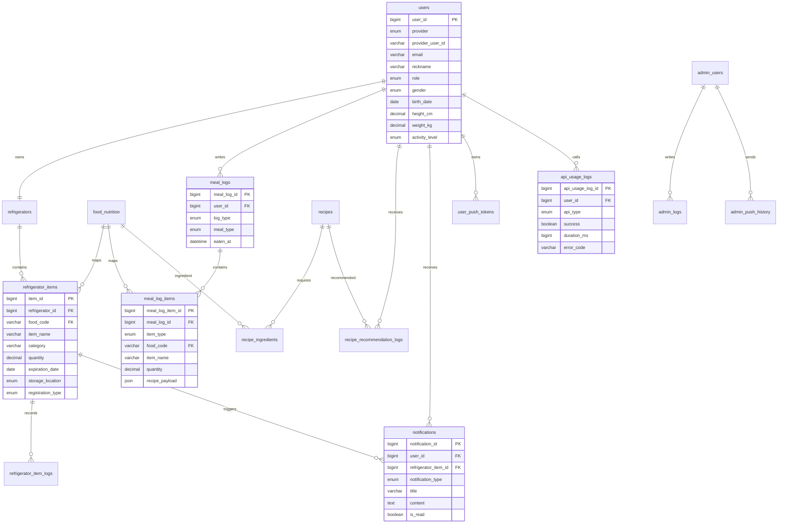

# ER 다이어그램

## 주요 테이블

| 영역 | 테이블 |
| --- | --- |
| 사용자 | `users`, `admin_users` |
| 냉장고 | `refrigerators`, `refrigerator_items`, `refrigerator_item_logs` |
| 음식/식단 | `food_nutrition`, `meal_logs`, `meal_log_items` |
| 레시피 | `recipes`, `recipe_ingredients`, `recipe_recommendation_logs` |
| 알림 | `notifications`, `user_push_tokens` |
| 운영 | `api_usage_logs`, `batch_job_history`, `admin_logs`, `admin_push_history` |

## ERD Mermaid 원본

## 설계 포인트

- 식단 기록과 레시피 추천 이력을 `meal_logs.log_type`과 `meal_log_items.item_type`으로 구분해 같은 기록 축에서 관리한다.
- 수기 등록 식재료는 `food_code`가 없을 수 있으므로 `refrigerator_items.food_code`는 nullable이다.
- 유통기한 알림 중복 생성을 막기 위해 `notifications`에 사용자, 재고, 상태, 기준일 조합의 unique key를 둔다.
- 외부 API 호출량은 `api_usage_logs`에 저장해 관리자 화면에서 OCR/바코드/레시피 추천 사용량을 확인한다.

## 테이블별 역할

| 테이블 | 역할 | 발표 강조점 |
| --- | --- | --- |
| `users` | OAuth 사용자와 온보딩 정보를 저장 | 추천/식단 개인화의 기준 데이터 |
| `refrigerator_items` | 사용자의 실제 재고 상태 저장 | 유통기한, 보관 위치, 등록 방식 관리 |
| `food_nutrition` | 음식 검색과 영양 계산의 기준 | 식단 요약 계산의 근거 데이터 |
| `meal_logs` | 식단 기록과 추천 이력의 상위 기록 | 소비 기록과 추천 결과를 같은 타임라인으로 관리 |
| `meal_log_items` | 식단 음식 또는 추천 recipe payload 저장 | 식단 상세와 추천 결과 저장을 유연하게 처리 |
| `notifications` | 유통기한/공지 알림 저장 | 사용자가 놓치기 쉬운 재료 상태를 알림으로 연결 |
| `api_usage_logs` | OCR/바코드/추천 호출 이력 저장 | 외부 API 비용과 장애 상황을 운영자가 확인 |
| `batch_job_history` | 유통기한 배치 실행 이력 저장 | 수동/스케줄 배치 결과를 관리자 화면에 표시 |

## 무결성과 인덱스 전략

- 사용자 탈퇴 또는 재고 삭제 이후에도 운영 로그를 보존해야 하는 영역은 `ON DELETE SET NULL` 또는 별도 로그 테이블로 분리한다.
- 음식명 검색과 레시피명 검색은 fulltext index를 사용해 발표 시 “검색 기반 입력 편의성”의 근거로 설명한다.
- 유통기한 알림은 같은 재고에 동일 기준일 알림이 중복 생성되지 않도록 unique key로 방어한다.
- API 사용량 집계는 `created_at`, `api_type` 기준 조회가 잦으므로 복합 index를 둔다.

## 데이터 흐름 예시

1. 사용자가 냉장고에 `우유`를 등록하면 `refrigerator_items`에 저장된다.
2. 배치가 유통기한을 확인해 `notifications`에 임박 알림을 생성한다.
3. 사용자가 식단 기록에서 `김밥`을 저장하면 `meal_logs`, `meal_log_items`에 기록된다.
4. 추천 생성 시 서버는 `refrigerator_items`를 읽고 추천 결과를 `meal_logs`/`meal_log_items`에 `RECOMMENDATION` 타입으로 저장한다.
5. OCR/바코드/추천 호출은 `api_usage_logs`에 기록되어 관리자 대시보드에서 확인된다.
