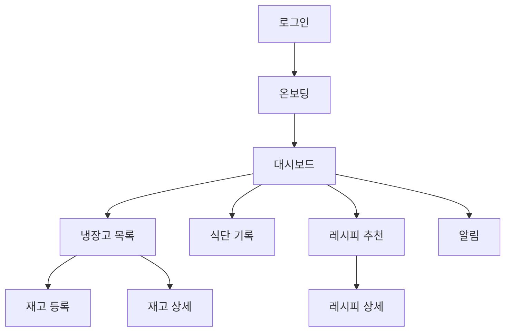
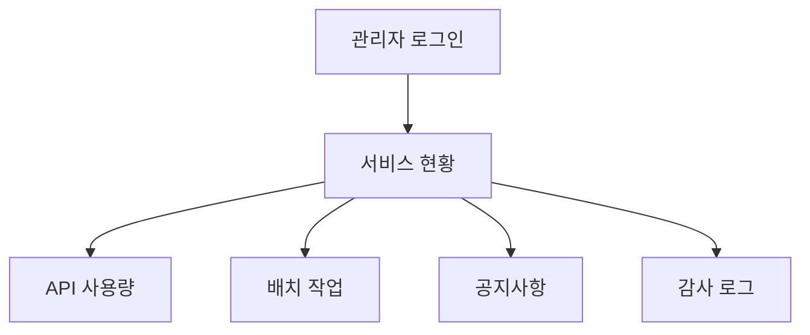

# 화면 설계서

## 화면 목록

| 화면 | 목적 | 주요 요소 | 캡처 파일명 |
| --- | --- | --- | --- |
| 로그인 | OAuth 로그인 진입 | 서비스 소개, Google/Naver/Kakao 버튼 | `01-login.png` |
| 온보딩 | 신규 사용자 정보 입력 | 닉네임, 성별, 생년월일, 키/몸무게, 활동량 | `02-onboarding.png` |
| 대시보드 | 서비스 현황 요약 | 재고 통계, 최근 재고, 알림, 추천 레시피 | `03-dashboard.png` |
| 냉장고 목록 | 재고 조회/필터 | 카테고리 필터, 유통기한 상태, 항목 카드 | `04-inventory-list.png` |
| 재고 등록 | 수기/OCR/바코드 등록 | 등록 방식, 다중 입력 폼, 분석 결과 | `05-inventory-add.png` |
| 재고 상세 | 개별 재고 확인/수정 | 수량, 위치, 유통기한, 수정/삭제 | `06-inventory-detail.png` |
| 식단 기록 | 음식 검색/저장 | 날짜, 끼니, 음식 검색, 영양 요약 | `07-meal-log.png` |
| 레시피 추천 | 재고 기반 추천 | 추천 카드, 매칭률, 부족 재료, 조리 단계 | `08-recipe-recommendation.png` |
| 알림 | 알림 조회/처리 | 유통기한/공지 알림, 읽음 처리 | `09-notifications.png` |
| 관리자 로그인 | 운영자 인증 | 아이디/비밀번호 로그인 | `10-admin-login.png` |
| 관리자 대시보드 | 운영 지표 확인 | 사용자 수, API 호출, 최근 배치 | `11-admin-dashboard.png` |
| 관리자 API/배치 | 운영 기능 | API 사용량 차트, 배치 실행, 공지 발송 | `12-admin-operations.png` |

## 사용자 화면 흐름

## 관리자 화면 흐름

## 화면 설계 원칙

- 발표자료에서는 기능 설명보다 사용자가 실제로 수행하는 흐름을 먼저 보여준다.
- 재고 등록은 `수기 입력`, `OCR`, `바코드` 3가지 진입을 한 화면에서 비교 가능하게 보여준다.
- 식단 기록은 `음식 검색 -> 항목 추가 -> 저장 -> 일일 요약 갱신`의 결과를 한 장에 담는다.
- 레시피 추천은 외부 API 모드보다 사용자가 얻는 결과, 즉 매칭률/활용 재료/부족 재료 중심으로 설명한다.
- 관리자 화면은 데모 안정성, API 비용/장애 관리, 운영 가능성을 뒷받침하는 근거로 사용한다.

## 화면별 발표 메시지

| 화면 | 발표 메시지 |
| --- | --- |
| 로그인 | “회원가입 폼 없이 OAuth로 빠르게 시작합니다.” |
| 온보딩 | “추천과 영양 요약에 필요한 최소 개인 정보를 입력합니다.” |
| 대시보드 | “재고 상태, 알림, 추천 결과를 한 화면에서 확인합니다.” |
| 냉장고 목록 | “재고가 유통기한 상태와 함께 정리되어 낭비를 줄입니다.” |
| 재고 등록 | “OCR/바코드/수기 입력을 하나의 등록 경험으로 묶었습니다.” |
| 식단 기록 | “먹은 음식과 영양 합계를 한 화면에서 관리합니다.” |
| 레시피 추천 | “냉장고에 있는 재료를 바로 조리 아이디어로 연결합니다.” |
| 알림 | “임박/만료/공지 알림으로 사용자의 다음 행동을 유도합니다.” |
| 관리자 | “PM/운영자가 API 사용량과 배치 상태를 확인할 수 있습니다.” |

## 화면 상태 기준

- 정상 상태: 데이터가 있는 대표 캡처를 발표자료 기본 이미지로 사용한다.
- 빈 상태: 기능 설명보다 “처음 시작하는 사용자도 이해 가능”한 onboarding/empty UX 보조 자료로만 사용한다.
- 오류 상태: 발표 본문에는 넣지 않고, Q&A나 기술 설명에서 fallback 전략을 설명할 때만 사용한다.
- 관리자 화면: 실제 계정 정보가 아닌 더미 사용자와 더미 관리자 계정 캡처만 사용한다.

## 캡처 품질 기준

- 화면 내 텍스트가 잘리지 않아야 한다.
- 브라우저 주소창과 개발자 도구는 포함하지 않는다.
- 발표 슬라이드에서 16:9 크롭이 가능하도록 핵심 정보는 화면 중앙 또는 상단에 배치된 캡처를 사용한다.
- 개인정보처럼 보이는 이메일, 토큰, client secret, API key는 캡처에 포함하지 않는다.
