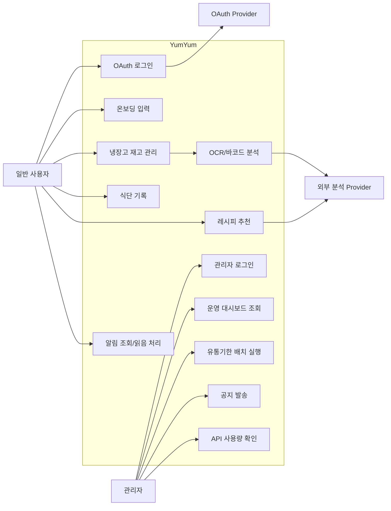

# Use-Case 다이어그램

## 주요 액터

- 일반 사용자: 냉장고, 식단, 추천, 알림 기능을 사용하는 사용자
- 관리자: 서비스 운영 상태를 확인하고 공지/배치 작업을 수행하는 운영자
- OAuth Provider: Google, Naver, Kakao 로그인 제공자
- 외부 분석 Provider: Pororo OCR, GMS/GPT, 식품안전나라 API

## Use-Case Mermaid 원본

## 주요 시나리오

| 시나리오 | 흐름 |
| --- | --- |
| 신규 사용자 시작 | OAuth 로그인 -> 온보딩 입력 -> 대시보드 진입 |
| 냉장고 등록 | 재고 추가 -> 수기/OCR/바코드 선택 -> 입력값 확인 -> batch 저장 |
| 식단 기록 | 음식 검색 -> 섭취량 입력 -> 저장 -> 일일 요약 갱신 |
| 레시피 추천 | 냉장고 재고 조회 -> 추천 생성 -> 추천 이력 저장 -> 레시피 카드 표시 |
| 유통기한 알림 | 배치 실행 -> 임박/만료 재고 조회 -> 알림 생성 -> 사용자 조회 |
| 관리자 운영 | 관리자 로그인 -> 지표 확인 -> 배치 수동 실행 -> 공지 발송 -> 감사 로그 확인 |

## Use-Case 상세 명세

| Use-Case | 선행 조건 | 기본 흐름 | 예외/대체 흐름 | 완료 조건 |
| --- | --- | --- | --- | --- |
| OAuth 로그인 | 사용자가 로그인 화면에 접근 | provider 선택 -> OAuth 인증 -> JWT 수신 -> 앱 진입 | 신규/Guest면 온보딩으로 이동 | 사용자 화면 접근 가능 |
| 냉장고 재고 등록 | 로그인 완료 | 등록 방식 선택 -> 상품 정보 입력/분석 -> batch 저장 | OCR/바코드 실패 시 수기 입력 유지 | 목록에 신규 재고 표시 |
| 식단 기록 저장 | 로그인 완료, 음식 DB 존재 | 음식 검색 -> 수량 입력 -> 저장 | 검색 결과 없음이면 다른 검색어 안내 | 기록 목록과 영양 요약 갱신 |
| 레시피 추천 생성 | 로그인 완료, 재고 1개 이상 | 재고 조회 -> provider 호출 -> 추천 저장 -> 화면 표시 | live 실패 시 fallback/mock 결과 표시 | 추천 카드와 최근 추천 이력 생성 |
| 알림 읽음 처리 | 알림 존재 | 알림 목록 조회 -> 개별/전체 읽음 처리 | 네트워크 실패 시 오류 메시지 표시 | unread badge 감소 |
| 관리자 공지 발송 | 관리자 로그인 | 공지 입력 -> 전체 사용자 대상 알림 생성 -> 이력 저장 | 권한 만료 시 관리자 로그인으로 이동 | 공지 이력과 감사 로그 생성 |

## 발표용 설명 포인트

- 일반 사용자 use-case는 “냉장고 데이터가 식단/추천/알림으로 확장되는 흐름”을 강조한다.
- 관리자 use-case는 “행사 데모와 운영 안정성을 PM이 직접 확인할 수 있는 장치”로 설명한다.
- 외부 Provider는 직접 화면에 드러나는 기능보다, 장애를 흡수하는 구조적 안전장치로 소개한다.
