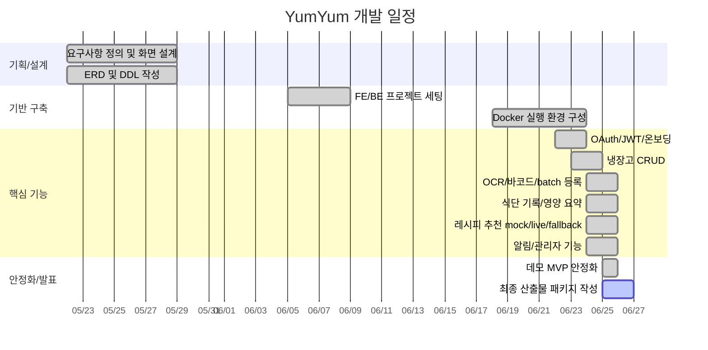

# WBS & 간트 차트

## WBS

| 단계 | 작업 | 산출물 |
| --- | --- | --- |
| 1. 기획 | 문제 정의, 기능 범위 선정, 화면 흐름 설계 | 요구사항 정의서, 화면 설계 |
| 2. 데이터 설계 | ERD 작성, DDL 작성, 초기 데이터 준비 | DB Schema.sql, 초기 데이터 |
| 3. 프로젝트 세팅 | Vue/Vite FE, Spring Boot BE, Docker Compose 구성 | 통합 실행 환경 |
| 4. 인증/사용자 | OAuth2, JWT, 온보딩, 프로필 | 로그인/온보딩 흐름 |
| 5. 냉장고 | 수기 등록, OCR/바코드 분석, CRUD | 재고 관리 화면/API |
| 6. 식단/추천 | 음식 검색, 식단 저장, 레시피 추천 provider | 식단 기록/추천 화면 |
| 7. 알림/관리자 | 유통기한 배치, 알림, 관리자 콘솔 | 운영 화면 |
| 8. 안정화 | mock/fallback 모드, 설정 정리, 빌드 검증 | 데모 MVP |
| 9. 최종 산출물 | 설계문서, 발표자료 프롬프트, AI 사용 보고서 | 제출 패키지 |

## Mermaid Gantt 원본

## 역할별 일정 플레이스홀더

| 이름 | 역할 | 주요 담당 | 개인 회고 입력 위치 |
| --- | --- | --- | --- |
| `[팀원 A]` | PM/QA | 요구사항, 시연 흐름, 최종 산출물 | `[개인 회고]` |
| `[팀원 B]` | Frontend | Vue 화면, 상태관리, UX | `[개인 회고]` |
| `[팀원 C]` | Backend | Spring Boot, DB, 인증, API | `[개인 회고]` |
| `[팀원 D]` | AI/OCR/Infra | OCR, 외부 API, Docker | `[개인 회고]` |

## 마일스톤 기준

| 마일스톤 | 완료 기준 | 근거 자료 |
| --- | --- | --- |
| M1. 기획/설계 확정 | 요구사항, ERD, 화면 설계 초안 완료 | 개발 일지 2026-05-22, 2026-05-29 |
| M2. 프로젝트 기반 구축 | FE/BE 구조와 통합 repo 구성 | 개발 일지 2026-06-05 |
| M3. 인증과 사용자 흐름 | OAuth, JWT, 온보딩, 프로필 구현 | 개발 일지 2026-06-22 |
| M4. 핵심 MVP 연결 | 냉장고, 알림, 추천, FE 연동 | 개발 일지 2026-06-23 |
| M5. 입력 자동화/인프라 | OCR, 바코드, Docker 통합 | 개발 일지 2026-06-24 |
| M6. 데모 안정화 | mock/fallback, 빌드 검증, 화면 캡처 | 커밋 `a963b9d`, `docs/final-report` |

## 리스크와 대응

| 리스크 | 영향 | 대응 |
| --- | --- | --- |
| 외부 API 키 누락 | 추천/OCR 시연 중단 | local/Docker 기본값을 mock으로 설정 |
| OCR 모델 cold start | 첫 요청 지연 | OCR 서비스 분리와 캐시 볼륨 사용 |
| OAuth redirect 설정 오류 | 로그인 시연 실패 | 발표 전 provider 1개와 테스트 계정으로 리허설 |
| 팀 정보/사진 누락 | 최종 PPT 완성도 하락 | `photos/README.md` 플레이스홀더 기준으로 제출 전 교체 |
| 발표자료 AI 환각 | 실제 구현과 다른 슬라이드 생성 | `slide-outline.md`와 스크린샷 파일명을 함께 제공하고 검수 |
